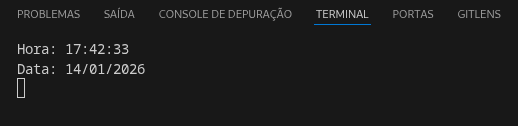

# ⏰ Node Clock Project

Este projeto em Node.js exibe, em tempo real, o horário atual no formato **HH:MM:SS** e a data no formato **DD/MM/AAAA**, atualizando as informações a cada **1 segundo** no terminal.

---

## 📁 Estrutura do projeto

```
clock-project/
└── app.js
```
---

## ▶️ Como executar

Execute no terminal o comando abaixo dentro da pasta do projeto:
```bash
node app.js
```
A data e a hora serão atualizadas a cada segundo no terminal.




---

### 🧠 Como funciona 
#### 🔹 Obtenção de data e hora

O projeto utiliza a classe nativa do JavaScript `Date` para obter o horário e a data atuais:
``` js
const now = new Date();
```
Essa classe já vem integrada ao JavaScript e ao Node.js, portanto **não é necessária nenhuma biblioteca externa**.

A partir dela, extraímos:
* `getHours()` → hora (0–23)
* `getMinutes() ` → minutos (0–59)
* `getSeconds() ` → segundos (0–59)
* `getDate()` → dia do mês (1–31)
* `getMonth()` → mês (0–11) — por isso é somado +1
* `getFullYear()` → ano com 4 dígitos
---
#### 🔹 Formatação dos valores
Para garantir que os números sempre tenham dois dígitos (ex: `08` em vez de `8`), foi utilizado:
``` js
number.toString().padStart(2, '0');
```
Isso adiciona um `0` à esquerda quando necessário.

----
#### 🔹 Atualização a cada 1 segundo

Para executar o código repetidamente em intervalos fixos, usamos `setInterval`:
``` js
setInterval(() => {
  // código executado a cada 1000ms (1 segundo)
}, 1000);
```
Essa função é ideal para tarefas que precisam rodar continuamente.

---
#### 🔹 Limpeza do terminal

Foi utilizado o `console.clear()` antes de imprimir os novos valores para manter a saída organizada e com aparência de “relógio em tempo real”.

----
### ✅ Tecnologias utilizadas

* Node.js
* JavaScript nativo (`Date`, `setInterval`, `console`)

---
### ✨ Possíveis melhorias futuras

* Exibir em uma página web em vez do terminal
* Permitir escolher fuso horário
* Utilizar biblioteca de datas como `dayjs` ou `luxon`
* Salvar logs de horário em um arquivo

---
### 📌 Objetivo do exercício

Este projeto pratica:
* Manipulação de data e hora em JavaScript
* Uso de funções assíncronas (`setInterval`)
* Formatação de strings
* Execução de aplicações Node.js no terminal