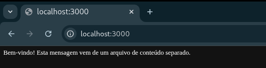

# 🚀 Express ESM Routes Project 

Este projeto demonstra a criação de um servidor web em **Node.js com Express**, utilizando **ESM (ECMAScript Modules)**, rotas organizadas em arquivo separado e funções em módulos distintos. O conteúdo exibido pelas rotas também fica em um arquivo próprio, mostrando uma separação clara de responsabilidades.

---

## 📁 Estrutura do projeto

```
express-esm-project/  
├── app.js  
├── routes.js  
├── functions.js  
├── content.js  
└── package.json
```
---

### Responsabilidade de cada arquivo

| Arquivo | Descrição |
|--------|-----------|
| `app.js` | Configuração principal do servidor Express |
| `routes.js` | Define todas as rotas GET |
| `functions.js` | Contém funções chamadas pelas rotas |
| `content.js` | Armazena textos/conteúdos exibidos ao usuário |
| `package.json` | Configuração do projeto e dependências |

---

## ⚙️ Configuração do projeto

### 1️⃣ Inicializar o projeto

No terminal:

```bash
mkdir express-esm-project
cd express-esm-project
npm init -y
npm install express
```
### 2️⃣ Habilitar ESM (`package.json`)

Certifique-se de que seu `package.json` contém:
```json
{  
  "name":  "express-esm-project",
  "version":  "1.0.0", 
  "type":  "module"  
}
```

👉 `"type": "module"` é obrigatório para usar `import/export` no Node sem extensão `.mjs`.

----------

## ▶️ Como executar

No diretório do projeto, execute:

`node app.js` 

Depois abra no navegador:

-   http://localhost:3000/
-   http://localhost:3000/about
-   http://localhost:3000/help
-   http://localhost:3000/time

Cada rota exibirá o conteúdo retornado por uma função localizada em outro arquivo.

Exemplo da página que apresenta o conteúdo da página raiz


----------

## 🧠 Como o projeto funciona

### 📄 `content.js` — Conteúdo separado

Este arquivo contém apenas textos que serão exibidos ao usuário, facilitando futuras alterações sem mexer na lógica do sistema.

### 📄 `functions.js` — Lógica das respostas

As rotas não retornam textos diretamente. Elas chamam funções que:

-   acessam o conteúdo em `content.js`
-   ou geram informações dinamicamente (como o horário atual)


Isso melhora organização e manutenção do código.

### 📄 `routes.js` — Rotas GET

Todas as rotas ficam concentradas em um único arquivo, usando `express.Router()`, o que deixa o projeto mais estruturado e próximo de aplicações reais.

### 📄 `app.js` — Servidor principal

Aqui o Express é configurado e o arquivo de rotas é registrado com:

`app.use(routes);` 

Isso mantém o arquivo principal limpo e fácil de entender.

----------

## ✅ Objetivos do exercício atendidos

Este projeto pratica:

-   Uso do **Express**
-   Criação de rotas **GET**
-   Separação de código em múltiplos arquivos
-   Uso de **ESM (import/export)**
-   Organização de rotas com `express.Router()`
-   Separação entre conteúdo e lógica

----------

## ✨ Possíveis melhorias futuras

Você pode evoluir este projeto com:

-   Controladores (`controllers/`)
-   Serviços (`services/`)
-   Middleware personalizado
-   Respostas em JSON
-   Integração com banco de dados
-   Testes automatizados
