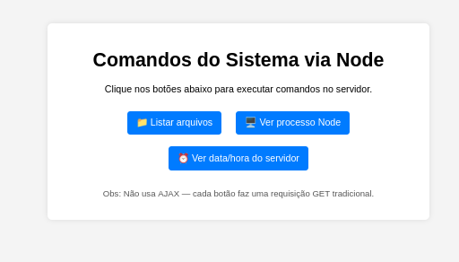

# 🌐 Node + Express: Execução de comandos do Sistema Operacional via Web (sem AJAX)

Este projeto demonstra como criar uma página web que, ao clicar em botões, faz com que um servidor **Node.js com Express** execute comandos do sistema operacional — **sem utilizar AJAX**.  
Toda a comunicação acontece por requisições HTTP tradicionais (GET), acionadas por links ou formulários.

---

## 📁 Estrutura do projeto

```
os-buttons-project/
├── app.js
├── routes.js
├── osService.js
├── pathUtil.js
└── public/
	├── index.html
	└── style.css
```
---

### Responsabilidade de cada arquivo

| Arquivo | Função |
|--------|--------|
| `app.js` | Configura o servidor Express e inicia a aplicação |
| `routes.js` | Define as rotas HTTP |
| `osService.js` | Executa comandos do sistema operacional |
| `pathUtil.js` | Resolve `__dirname` no padrão ESM |
| `public/index.html` | Interface com botões para o usuário |
| `public/style.css` | Estilização da página |

---

## ▶️ Como executar

1. Instale as dependências:
```bash
npm install
```
2. Inicie o servidor:
``` bash
node app.js
```
3. Abra no navegador:
``` bash
http://localhost:3000
```
Haverá três botões na tela.




### 🔘 O que cada botão faz
Botão	| Rota	| Comando executado no servidor
--- | --- | ---
📁 Listar arquivos	| /list-files	|  ls -l
🖥️ Ver processo Node	| /node-process	| ps auxw (filtrado pelo PID atual)
⏰ Ver data/hora	|  /datetime	|  date

Ao clicar em qualquer botão:
1. O navegador faz uma requisição **GET tradicional** ao servidor.
2. O servidor Node executa um comando do sistema operacional.
3. A hora e hora é retornada e exibida no navegador.
---
### 🧠 O que significa “sem AJAX” neste exercício

Neste projeto **não foi utilizado JavaScript no navegador para fazer requisições assíncronas** (como `fetch`, `axios` ou `XMLHttpRequest`).

Em vez disso:
* Os botões são apenas **links ou formulários HTML**.
* Cada clique gera uma requisição HTTP completa ao servidor.
* O navegador recarrega a página com a resposta do servidor.

Isso demonstra o funcionamento clássico da web (cliente → servidor → resposta).

---
### 🛠️ Tecnologias utilizadas

* Node.js
* Express
* child_process (nativo do Node)
* HTML e CSS simples

---
### 🎯 Objetivo do exercício

Este projeto pratica:
* Criação de servidor com **Express** 
* Definição de rotas GET 
* Execução de comandos do sistema operacional via Node 
* Separação de responsabilidades em múltiplos arquivos
* Comunicação web **sem AJAX**
* Diferença entre cliente (navegador) e servidor (Node)

---
### 🚀 Possíveis melhorias futuras

* Usar AJAX (`fetch`) para atualizar apenas partes da página
* Retornar dados em JSON em vez de HTML
* Adicionar autenticação para proteger os comandos
* Criar um painel administrativo mais completo
* Registrar logs das execuções em arquivo